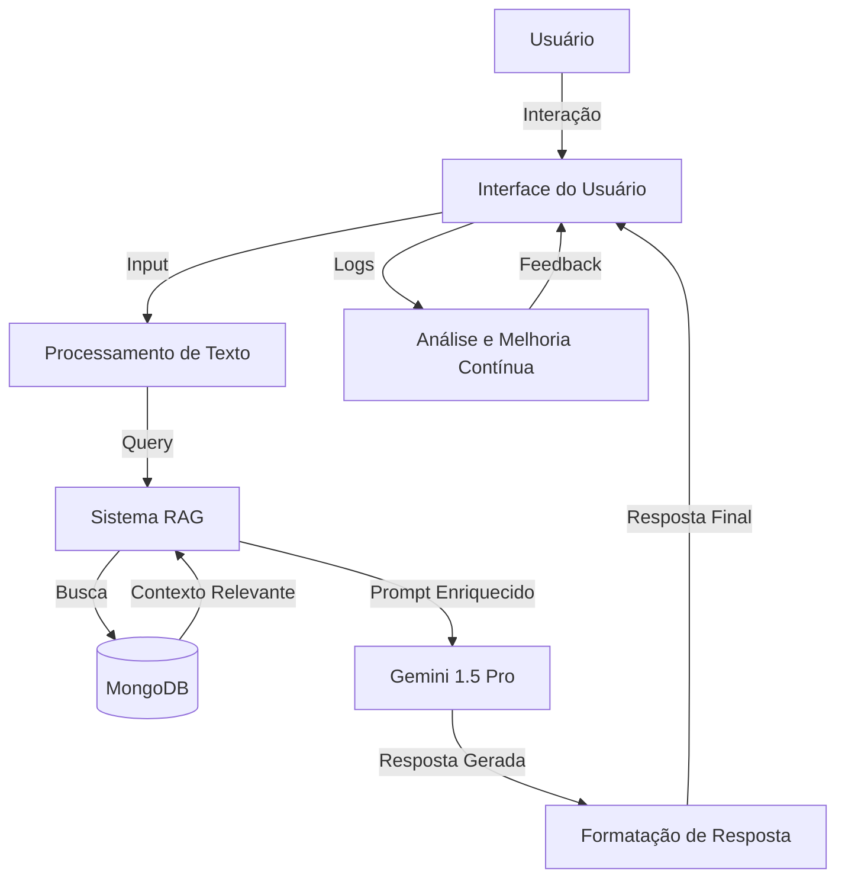

# Projeto de Chatbot Avançado para MMoveis
## Visão Geral

O projeto visa desenvolver um chatbot de suporte técnico corporativo chamado Maria para a MMoveis, uma empresa de comércio varejista no Brasil. O chatbot será projetado para auxiliar filiais na abertura de chamados, fornecer suporte básico em questões de TI, e ajudar com dúvidas sobre sistemas e acessos.
Características Principais

    - Personalidade empática e profissional
    - Suporte para abertura de chamados
    - Assistência em questões básicas de TI
    - Ajuda com dúvidas sobre sistemas e acessos
    - Linguagem clara e não-técnica

### Arquitetura Técnica

    - Frontend: Next.js com componentes shadcn/ui
    - Backend: Gemini 1.5 Pro como modelo de linguagem
    - Banco de Dados: MongoDB
    - Sistema RAG (Retrieval-Augmented Generation) para gerenciamento de conhecimento

### Implementação de RAG

    - Criação de embeddings de documentos com chunking
    - Tamanho de chunk: 512 tokens com 10% de sobreposição
    - Índice vetorial para busca semântica eficiente

### Gerenciamento de Tokens

    - Input máximo: 2048 tokens
    - Contexto: até 8192 tokens
    - Output limitado a 1024 tokens
    - Implementação de sliding window para documentos extensos

### Interface do Usuário

    - Design responsivo com tema claro/escuro automático
    - Animações suaves e feedback visual imediato
    - Recursos interativos como autocompletar e sugestões contextuais

### Métricas de Sucesso

    - Tempo médio de resposta < 2 segundos
    - Precisão das respostas > 95%
    - Satisfação do usuário > 4.5/5
    - Redução de 30% em chamados básicos de TI

